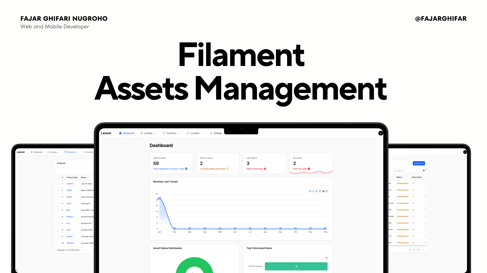

# Asset Management System 🏢


A comprehensive **Asset & Loan Management System** built with **Laravel 12** and **Livewire 3**. Designed to streamline internal company operations, tracking assets (IT equipment, Furniture), consumable stocks, and employee loans with approval workflows.



---

## ✨ Key Features

### 📦 Asset Management
* **Lifecycle Tracking:** Complete history of every asset (Purchase, Assignment, Moving, Return, Disposal).
* **Location Management:** Track assets across multiple sites and specific room locations.
* **Smart Actions:**
    * **Check-In / Check-Out:** Assign assets to employees with automated history logging.
    * **Moving:** Transfer assets between locations with reason tracking.
    * **Maintenance Status:** Mark assets as "In Repair" or "Broken".
* **Bulk Import:** Smart Excel import using **OpenSpout v4** with auto-tag generation.

### 📊 Consumable Stock
* **Stock Tracking:** Real-time inventory management for disposable items (ATK, Paper, Ink).
* **Low Stock Alerts:** Dashboard indicators for items running below minimum thresholds.
* **Auto-Deduction:** Stock is automatically deducted when included in approved loan requests.

### 🧰 Asset Kits
* **One-Click Loans:** Bundle frequently used items (e.g., "Event Kit": Camera + Tripod + Cables) into a single Kit.
* **Smart Resolution:** Automatically finds available items from stock when a Kit is requested.
* **Fallback Strategy:** Intelligent search for alternative locations if primary stock is insufficient.

### 📝 Loan & Approval System
* **Hybrid Loans:** Support for mixing **Returnable Assets** (Laptops) and **Consumables** (Pens) in a single loan request.
* **Approval Workflow:**
    * **Pending:** Draft request waiting for admin review.
    * **Approved:** Items deducted from stock/status updated.
    * **Rejected:** Logged with rejection reason.
    * **Returned/Overdue:** Tracking return dates and overdue status.
* **Partial Returns:** Ability to return specific items from a bulk loan (e.g., returning 1 of 2 borrowed laptops).

### 📈 Dashboard & Reporting
* **Real-time Overview:**
    * Total Assets Value & Count.
    * Active Loans & Overdue Loans.
    * Low Stock warnings.
* **Interactive Charts:**
    * **Chart.js** integration for Loan Trends and Status Distribution.
* **Export/Import:** Bulk data management via Excel for Assets, Products, and Stocks.

---

## 🛠️ Tech Stack

* **Backend:** [Laravel 12](https://laravel.com/)
* **Frontend:** [Livewire 3](https://livewire.laravel.com/), [Alpine.js v3](https://alpinejs.dev/), [TailwindCSS v4](https://tailwindcss.com/)
*   **Tables:** [PowerGrid v6](https://livewire-powergrid.com/)
*   **Import/Export:** [OpenSpout v4](https://github.com/openspout/openspout)
*   **Charts:** [Chart.js](https://www.chartjs.org/)
* **Database:** MySQL / MariaDB
* **Icons:** Blade Heroicons v2

---

## 🏗️ Architecture Highlights

1.  **Service-Oriented Architecture:**
    *   **`LoanService`:** Centralized logic for loan lifecycles (creation, approval, return), ensuring extensive validation coverage.
    *   **`AssetService`:** Manages asset state transitions and history logging (movements, status changes).
    *   **`ConsumableStockService`:** Handles stock adjustments and low-stock threshold logic.
2.  **Hybrid Persistence (`LoanForm` & `CreateLoan`):**
    *   Handles complex polymorphic relationships (Assets vs. Consumables) by manually processing form data to ensure data integrity.
3.  **Data Import Engine:**
    *   Uses **OpenSpout** for high-performance Excel processing.
    *   Implements "Update or Create" strategies for robust bulk data management.
    *   Detailed error reporting for row-level validation failures.
4.  **Concurrency Control:**
    *   Database transactions and locking mechanisms (`lockForUpdate`) prevent race conditions during high-volume stock deductions or asset assignments.

---

## 🚀 Installation Guide

### 1. Clone the Repository
```bash
git clone https://github.com/fajarghifar/asset-management-system.git
cd asset-management-system
```

### 2. Install Dependencies

```bash
composer install
npm install && npm run build
```

### 3. Environment Setup

Copy the example environment file:
```bash
cp .env.example .env
```
Open `.env` and configure your database:
```options
DB_CONNECTION=mysql
DB_HOST=127.0.0.1
DB_PORT=3306
DB_DATABASE=asset_management_system
DB_USERNAME=root
DB_PASSWORD=
```

Generate the application key and storage link:
```bash
php artisan key:generate
php artisan storage:link
```

### 4. Database Setup & Seeding (Fast Reset)

This project uses the standard Artisan command to migrate and seed data in the correct order.
**Warning:** This command will wipe your database (`migrate:fresh`).

```bash
php artisan migrate:fresh --seed
```
> *This script will sequentially run all seeders to populate initial data:*
> *   **Users:** Admin
> *   **Master Data:** Locations, Categories
> *   **Inventory:** Initial Assets and Consumable Stocks.

### 5. Run the Server

```bash
php artisan serve
```

Access the application at `http://localhost:8000`.

---

## 🔑 Default Credentials

| Role | Username | Password |
| --- | --- | --- |
| **Admin** | `admin` | `password` |

> **Note:** Please change credentials immediately after deployment.

---

## 🤝 Contributing

Contributions are what make the open-source community such an amazing place to learn, inspire, and create. Any contributions you make are **greatly appreciated**.

1.  Fork the Project
2.  Create your Feature Branch (`git checkout -b feature/AmazingFeature`)
3.  Commit your Changes (`git commit -m 'Add some AmazingFeature'`)
4.  Push to the Branch (`git push origin feature/AmazingFeature`)
5.  Open a Pull Request

---

## 💖 Support

If you find this project helpful, please consider giving it a ⭐️ star on GitHub or buying me a coffee!

<a href="https://buymeacoffee.com/fajarghifar" target="_blank"></a>

---

## 📄 License

Licensed under the [MIT License](LICENSE).

---

> Find me on [GitHub](https://github.com/fajarghifar) &nbsp;&middot;&nbsp; [YouTube](https://www.youtube.com/@fajarghifar) &nbsp;&middot;&nbsp; [Instagram](https://instagram.com/fajarghifar) &nbsp;&middot;&nbsp; [LinkedIn](https://www.linkedin.com/in/fajarghifar/)
